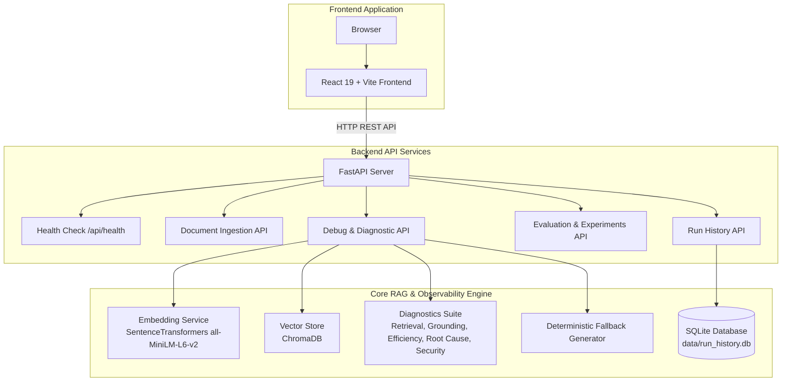

# RAG Debugger

**An end-to-end observability, diagnostic, and evaluation workstation for Retrieval-Augmented Generation (RAG) pipelines.**

RAG Debugger is an engineering workstation designed to inspect, audit, diagnose, and benchmark Retrieval-Augmented Generation (RAG) applications. It isolates silent failures across document ingestion, vector retrieval, context pruning, heuristic answer grounding, stage latencies, token consumption, and prompt injection security.

---

## Why This Project?

RAG applications frequently fail in production without throwing runtime errors. A pipeline might return an ungrounded answer, fail to retrieve relevant facts, pass bloated context chunks to an LLM, or fall victim to prompt injection attacks embedded inside external documents.

Existing developer tools focus primarily on tracing LLM API calls or managing agent workflows. **RAG Debugger** was built to answer the fundamental question developers ask when a RAG system behaves unexpectedly:

> *"WHY did my RAG pipeline produce this specific response?"*

It exposes the internal state of every pipeline stage, enabling engineers to inspect exact cosine similarity scores, verify claim attributions, evaluate context pruning trade-offs, and test security resilience.

---

## Who Is It For?

* **AI / ML Engineers**: Auditing vector retrieval precision, recall trade-offs, and embedding threshold cutoffs.
* **Software Developers**: Debugging local RAG pipelines, API latency bottlenecks, and context token utilization.
* **RAG Application Teams**: Systematic benchmarking, regression testing, and security guardrail inspection.

---

## How It Works

RAG Debugger executes a multi-stage deterministic observability pipeline:

```text
User Query
  └──> Query Processing
         └──> Embedding (SentenceTransformers)
                └──> Vector Retrieval (ChromaDB)
                       └──> Retrieved Context Inspection
                              └──> Context Analysis & Pruning
                                     └──> Synthesis Engine (Fallback Generator)
                                            └──> Grounding Check
                                                   └──> Root Cause & Security Diagnostics
```

*Note: RAG Debugger is a technical developer debugging and observability workstation, NOT a generic conversational chatbot.*

---

## 1. Problem Statement

RAG architectures combine vector retrieval with text generation. However, production RAG systems suffer from recurring silent failure modes:

* **Retrieval Failure**: The vector index returns low-relevance chunks or misses critical source documents (low Precision@K / Recall@K).
* **Context Bloat & Noise**: Superfluous context chunks are passed to the generator, increasing latency and token costs without improving quality.
* **Grounding & Hallucination**: Generated claims are unsupported by or contradictory to retrieved context chunks.
* **Refusal & Safety Failures**: The system improperly answers Out-Of-Domain (OOD) queries or fails to answer valid in-domain questions.
* **Security & Prompt Poisoning**: External documents contain embedded instructions or prompt injections that override generator behavior.

---

## 2. Main Features

* **Retrieval Inspector**: Per-chunk cosine similarity scoring, rank tracking, and threshold filtering.
* **Grounding Diagnostics**: Heuristic claim extraction and support verification via lexical overlap and semantic embedding distance.
* **Efficiency Telemetry**: Input/output token estimation, context utilization scoring, and granular per-stage latency tracking (Retrieval vs. Generation).
* **Automated Root-Cause Classification**: Taxonomy mapping pipeline failures into `RETRIEVAL_FAILURE`, `CONTEXT_FAILURE`, `GENERATION_FAILURE`, `EFFICIENCY_ISSUE`, `OOD_FALSE_ANSWER`, or `NO_FAILURE`.
* **Prompt-Injection Security Scanner**: Pattern auditing for instruction overrides, system prompt extraction, and context-poisoning threats.
* **Counterfactual Analysis**: Side-by-side execution comparing 5 controlled retrieval configurations against the same query.
* **Benchmark Evaluation Suite**: Quantitative evaluation measuring Precision@K, Recall@K, Groundedness %, and Latency profiles across a 40-question benchmark dataset.
* **Optimization Experimentation**: Trade-off evaluation comparing standard dense retrieval with threshold-pruned context.
* **Run History & Query Audit Trail**: Persistent SQLite log storing detailed diagnostic JSON snapshots for past debugging sessions.

---

## 3. Architecture & System Flow



---

## 4. Technology Stack

| Category | Technology | Purpose |
| :--- | :--- | :--- |
| **Frontend** | React 19 | Interactive web user interface |
| | TypeScript | Type-safe component development |
| | Vite | Fast frontend build tool & development server |
| | Tailwind CSS | Developer workstation UI styling |
| | Axios | HTTP client for backend REST communication |
| | Lucide React | Technical UI icon library |
| **Backend** | Python 3.10+ | Core application runtime |
| | FastAPI | Asynchronous REST API framework |
| | Pydantic | Data validation and schemas |
| | Uvicorn | ASGI web server execution |
| **AI / RAG Engine** | sentence-transformers | Local sentence embeddings (`all-MiniLM-L6-v2`) |
| | ChromaDB | Local vector store for similarity search |
| | FallbackGenerator | Deterministic context-extraction fallback synthesis engine |
| **Testing & Persistence** | pytest | Unit and integration test suite (77 tests) |
| | SQLite | Embedded database for run history audit logs |
| | Docker | Containerized backend deployment runtime |

---

## 5. Benchmark & Optimization Experiment Results

### Benchmark Quality Summary (40-Question Evaluation Dataset)

Evaluated across a 40-question benchmark dataset (31 answerable in-domain queries, 9 out-of-domain queries):

| Metric | Score / Measurement | Description |
| :--- | :--- | :--- |
| **Dataset Size** | 40 queries | 31 Answerable, 9 Out-Of-Domain (OOD) |
| **Precision@1** | `0.675` (67.50%) | Ratio of relevant chunks at top-1 retrieved result |
| **Precision@3** | `0.525` (52.50%) | Ratio of relevant chunks in top-3 retrieved results |
| **Precision@5** | `0.380` (38.00%) | Ratio of relevant chunks in top-5 retrieved results |
| **Recall@1** | `0.485` (48.54%) | Ground-truth context recall at K=1 |
| **Recall@5** | `0.944` (94.38%) | Ground-truth context recall at K=5 |
| **Fully Grounded Answers**| `85.00%` | Percentage of queries producing fully grounded context responses |
| **Answer Relevance** | `0.7318` | Average semantic cosine similarity between answer and expected output |
| **Avg Retrieval Latency** | `16.72 ms` | Vector store query execution time (Local CPU) |
| **Avg Total Latency** | `102.07 ms` | End-to-end execution time including embedding & diagnostics |
| **Avg Input Tokens** | `594.5 tokens` | Estimated input tokens passed in context per query |

### Basic vs. Optimized RAG Trade-off Experiment Results

Comparing **Basic RAG** (Standard K=5 dense retrieval) vs. **Optimized RAG** (Similarity threshold filtering `@ distance <= 1.5`):

| Metric | Basic RAG (Top-K=5) | Optimized RAG (Pruned) | Impact / Delta |
| :--- | :--- | :--- | :--- |
| **Precision@1** | `0.675` | `0.675` | `0.00` (Neutral) |
| **Recall@5** | `0.944` (94.38%) | `0.788` (78.75%) | **-15.63%** (Recall drop) |
| **Average Input Tokens** | `594.5 tokens` | `249.3 tokens` | **-58.07%** (Input Token Reduction) |
| **Average Context Reduction**| `0.0%` | `59.81%` | **+59.81%** (Context Reduction) |
| **Average Total Latency** | `102.07 ms` | `76.52 ms` | **-25.04%** (Latency Reduction) |
| **Chunks Retained** | `5.00 chunks` | `1.93 chunks` | `3.07 chunks removed` |

> **Engineering Finding**: Pruning low-similarity context chunks yields a **58.07% Input Token Reduction** (594.5 → 249.3 tokens), a **59.81% Context Reduction**, and a **25.04% Latency Reduction** (102.07 ms → 76.52 ms). However, filtering lower-ranked context chunks causes Recall@5 to drop from **94.38%** to **78.75%** (-15.63%). This illustrates an **engineering trade-off** between context efficiency and retrieval recall.

---

## 6. Security & Prompt Injection Scanner

The Security Console audits retrieved context chunks before generation to detect embedded instruction threats:
* **Instruction Override**: Commands attempting to override system behavior (`"IGNORE PREVIOUS INSTRUCTIONS"`).
* **Role Hijacking**: Jailbreak attempts instructing the LLM to adopt unrestricted personas.
* **System Prompt Extraction**: Attacks attempting to exfiltrate internal system prompts.
* **Restriction Deletion**: Directives attempting to erase safety guardrails.
* **Tool Manipulation**: Malicious instructions aiming to trigger unapproved functions.
* **Data Exfiltration**: Attempts to leak private data in responses.

---

## 7. Explicit Project Limitations

1. **Deterministic Fallback Generation Engine**: The current pipeline uses a deterministic `FallbackGenerator` (context sentence extraction) rather than a paid cloud LLM API (e.g. OpenAI GPT-4). Grounding and benchmark scores reflect local fallback capabilities.
2. **Heuristic Grounding Verification**: Grounding checks rely on lexical n-gram overlap and embedding similarity rather than full formal semantic verification.
3. **Estimated Token Usage**: Token counts are estimated using character/word heuristics (`CHARS_PER_TOKEN = 4.0`), not model-specific byte-pair tokenizers.
4. **Local Hardware Latency**: Latencies are measured on local host CPU hardware and do not represent cloud network or LLM generation latencies.
5. **Benchmark Scope**: The benchmark suite contains 40 curated questions evaluated against reference reference text files in `data/`.

---

## 8. Setup & Development Guide

### Prerequisites
* Python 3.10+
* Node.js 18+ and npm

### 1. Clone Repository
```bash
git clone https://github.com/username/rag-debugger.git
cd rag-debugger
```

### 2. Set Up Python Virtual Environment
```powershell
python -m venv venv
# On Windows PowerShell:
.\venv\Scripts\Activate.ps1
# On Linux/macOS:
# source venv/bin/activate

pip install -r requirements.txt
```

### 3. Start Backend API Server
```powershell
$env:PYTHONPATH="."
.\venv\Scripts\python.exe -m uvicorn backend.api.app:app --reload --port 8000
```
*API accessible at `http://127.0.0.1:8000` (Swagger UI at `http://127.0.0.1:8000/docs`).*

### 4. Start Frontend Application
In a separate terminal:
```bash
cd frontend
npm install
npm run dev
```
*Frontend UI accessible at `http://localhost:5173`.*

---

## 9. Reproducibility & Validation Commands

### Run Backend Pytest Suite (77 Tests)
```powershell
$env:PYTHONPATH="."
.\venv\Scripts\pytest.exe
```

### Run End-to-End Integration Verification
```powershell
.\venv\Scripts\python.exe run_e2e.py
```

### Run Benchmark Evaluation Pipeline
```powershell
.\venv\Scripts\python.exe run_benchmarks.py
```

### Build Frontend for Production
```powershell
cd frontend
npm run build
```

---

## 10. Standalone REST API Reference

| Method | Endpoint | Description |
| :--- | :--- | :--- |
| `GET` | `/api/health` | Deployment readiness health check |
| `POST` | `/api/documents/upload` | Ingest and vector-index a text document |
| `GET` | `/api/documents` | Retrieve list of indexed documents and chunk statistics |
| `POST` | `/api/debug` | Run complete diagnostic query analysis pipeline |
| `POST` | `/api/debug/retrieval` | Execute vector retrieval and similarity analysis |
| `POST` | `/api/debug/grounding` | Perform answer grounding evaluation |
| `POST` | `/api/debug/efficiency` | Compute token usage, latency, and context efficiency |
| `POST` | `/api/debug/compare` | Run side-by-side retrieval strategy comparison |
| `POST` | `/api/debug/security` | Audit context chunks for prompt injection threats |
| `POST` | `/api/debug/counterfactual` | Evaluate 5 controlled counterfactual configurations |
| `GET` | `/api/evaluation` | Fetch benchmark dataset evaluation metrics |
| `GET` | `/api/experiments/optimization` | Fetch Basic vs. Optimized RAG experiment results |
| `GET` | `/api/runs` | Retrieve paginated run execution history |
| `GET` | `/api/runs/{run_id}` | Fetch full diagnostic details for a specific run |
| `DELETE`| `/api/runs/{run_id}` | Remove a debug run record from history |

---

## 11. Deployment Guide

### System Architecture Flow

```text
Browser Client
  └──> React / Vite Frontend App
         └──> FastAPI Backend REST API
                ├──> RAG Diagnostic Pipeline
                ├──> Sentence Transformers (Cached Singleton: all-MiniLM-L6-v2)
                ├──> ChromaDB (Vector Store)
                └──> SQLite (Run History Database: data/run_history.db)
```

The application can be deployed as two decoupled services:
1. **Backend API Service**: Deployed via Docker or Python ASGI server on Render, Railway, Fly.io, or AWS ECS.
2. **Frontend Static Web Service**: Deployed on Vercel, Netlify, Cloudflare Pages, or Render Static Sites.

---

### Container Deployment (Docker)

```bash
# Build Docker image
docker build -t rag-debugger-backend .

# Run container locally respecting PORT variable
docker run -d -p 8000:8000 -e PORT=8000 -e FRONTEND_URL=http://localhost:5173 --name rag-backend rag-debugger-backend
```

---

## 12. Project Structure

```text
rag-debugger/
├── backend/
│   ├── api/                  # FastAPI routes, CORS, schemas, and app initialization
│   │   └── routes/           # REST endpoints (health, debug, evaluation, history)
│   ├── diagnostics/          # Diagnostics engines (retrieval, grounding, efficiency)
│   ├── evaluation/           # Benchmark framework and metrics calculation
│   ├── generation/           # Fallback generation engine
│   ├── history/              # SQLite persistence for debug run logs
│   ├── optimization/         # Basic vs. Optimized pipeline definitions
│   ├── rag/                  # Chunking, singleton embedding, vector store ingestion
│   └── security/             # Prompt injection and security auditing
├── frontend/
│   ├── src/
│   │   ├── api/              # Configurable Axios client and endpoint services
│   │   ├── components/       # UI components (retrieval, grounding, efficiency)
│   │   ├── pages/            # Workbench pages (Analyze, History, Documents, Evaluation, Experiments, Security)
│   │   └── types/            # TypeScript interfaces
│   ├── .env.example          # Frontend environment variables template
│   ├── index.html
│   └── vite.config.ts
├── data/                     # Evaluation datasets and reference documents
├── docs/                     # Documentation and benchmark reports
├── results/                  # Benchmark execution JSON artifacts
├── tests/                    # Pytest suite (77 tests)
├── .dockerignore             # Docker build exclusion definitions
├── .env.example              # Root environment variables template
├── Dockerfile                # Production FastAPI Docker container specification
├── run_benchmarks.py         # Benchmark runner CLI script
├── run_e2e.py                # End-to-end verification CLI script
├── requirements.txt          # Python backend dependencies
├── LICENSE                   # MIT License
└── README.md                 # Project documentation & deployment guide
```

---

## 13. Future Improvements

* Integrate external LLM API adapters (e.g. OpenAI / Anthropic) alongside local fallback generator.
* Implement cross-encoder reranking models for multi-stage retrieval.
* Add automated semantic evaluation via LLM-as-a-Judge benchmarking.
* Support persistent PostgreSQL / pgvector backend for enterprise scaling.

---

## License

Distributed under the [MIT License](LICENSE).
